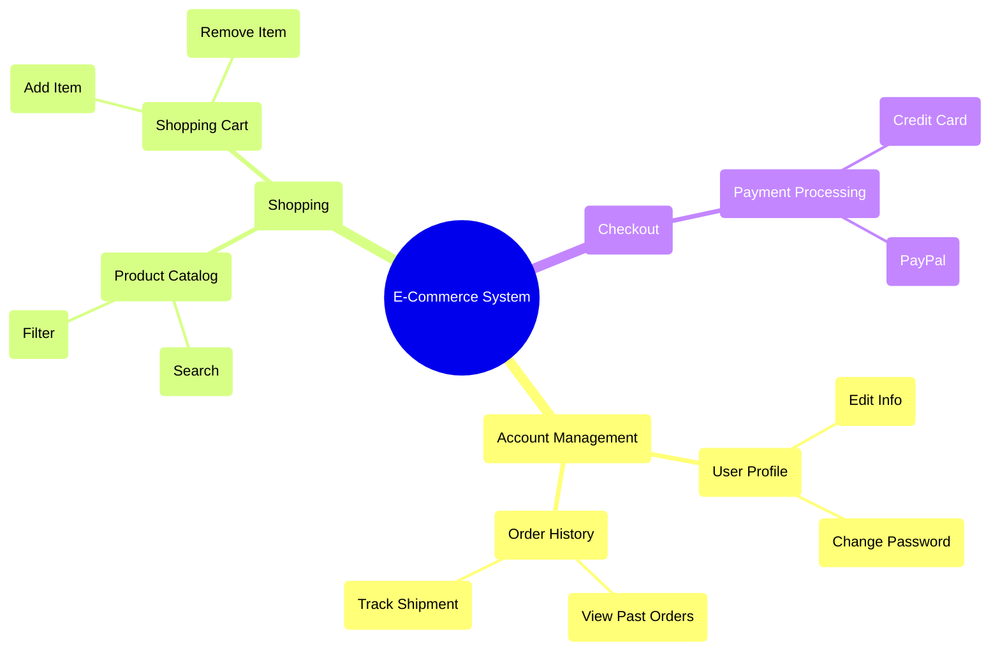

# Feature Tree Examples

Use this Mermaid.js Mindmap format to visualize the Feature Tree.

## Example: E-Commerce System

## Gap Analysis Example
Looking at the tree above, an agent might ask:
- *"Under `L1_Account -> L2_Profile`, we have `Edit Info` and `Change Password`. Do we need a `Delete Account` feature?"*
- *"Under `L1_Shopping -> L2_Cart`, we have `Add` and `Remove`. Do we need an `Update Quantity` feature?"*
