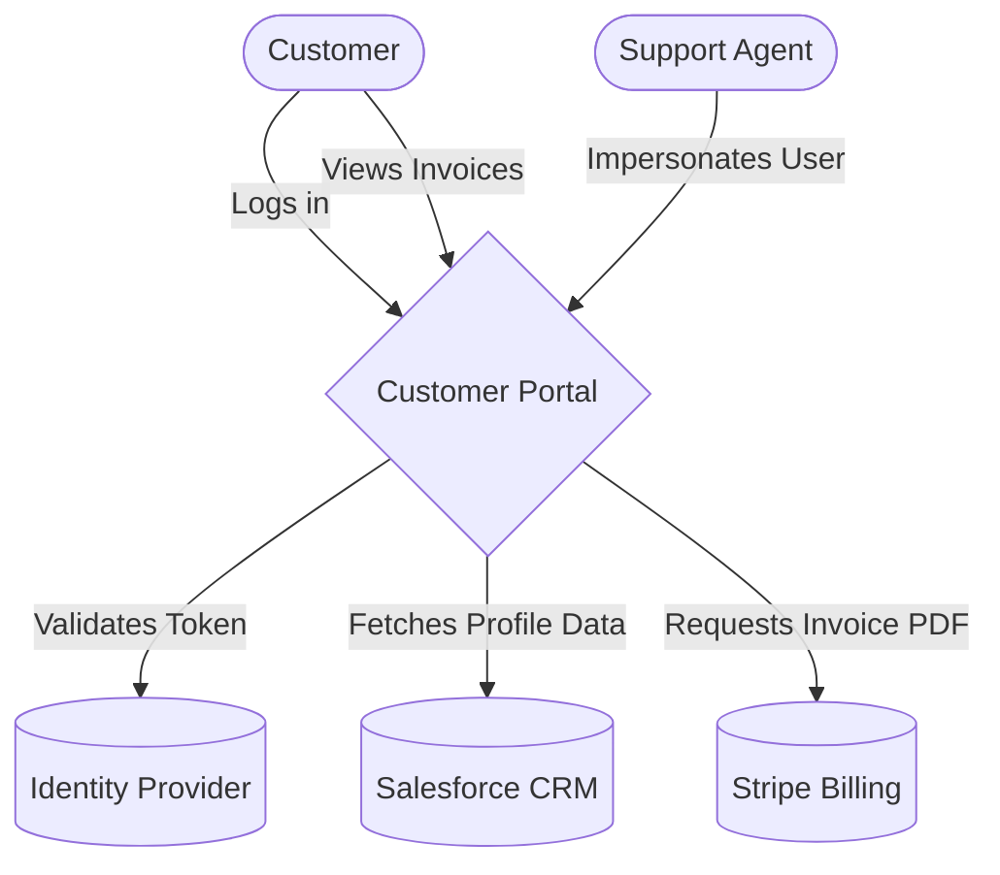

# Ecosystem Map Template

Use this Mermaid.js format to visualize the Ecosystem Map.

## Guidelines
- Use a distinct shape or color for the System Under Design (SUD).
- Use `([ ])` for human actors.
- Use `[( )]` for databases/external systems.
- Always label the arrows with the data being passed.

## Example: Customer Portal Ecosystem

## Gap Analysis Example
After drawing the map, analyze the arrows:
- *"The SUD fetches profile data from the CRM, but does it ever push updates back to the CRM when the user edits their profile?"*
- *"We show the Customer logging in, but what system handles password resets?"*
