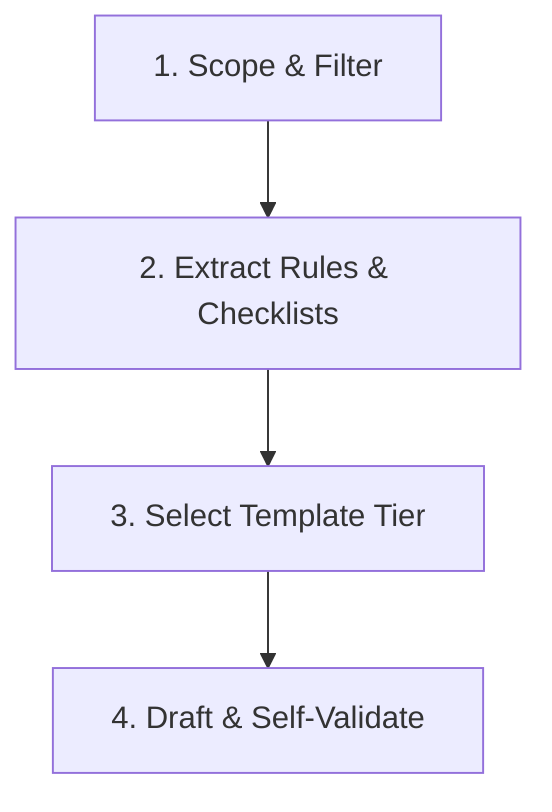

# Guidelines for Extracting Skills from Technical Books

This guide defines the methodology for transforming passive textbook knowledge into active, executable, and testable agent skills (`SKILL.md` packages). 

---

## 1. The Core Objective: Passive Theory to Active Execution

Textbooks are written to explain concepts to humans. AI coding agents, however, perform poorly with general narratives. They need **procedural checklists, strict constraints, and concrete input/output validation steps**.

| Passive Textbook Style | Active Agent Skill Style |
| :--- | :--- |
| "Dynamic memory allocation should be avoided in real-time embedded systems because heap fragmentation can lead to non-deterministic failure." | **Constraint**: Do not use dynamic allocation (`malloc`, `calloc`, `new`, `free`) in code files. All buffers and structures must be statically allocated at compile-time or initialization. |
| "When designing an Interrupt Service Routine (ISR), the developer must keep it short and avoid calling blocking functions." | **How-To / Checklist**: Verify that the ISR: 1. Does not call blocking APIs (e.g., mutex lock, delay). 2. Clears the interrupt flag immediately. 3. Defers heavy processing to a background task (e.g., via task notifications or queues). |

---

## 2. Embedded & Systems Engineering Focus Areas

For a senior embedded software architect, a skill is only useful if it respects physical and architectural realities. When extracting skills from books on embedded software, RTOS, or safety-critical design, you must search for and extract the following dimensions:

### A. Memory & Resource Constraints
*   **Static vs. Dynamic Allocation**: Rules on heap usage, static pools, or thread stack limits.
*   **Stack Management**: Requirements for checking stack overflow guards, local array boundaries, and recursive call bans.
*   **Memory-Mapped I/O**: Guidelines for using `volatile` qualifiers, register structures, and alignment constraints.

### B. Timing & Real-Time Constraints
*   **Determinism**: Rules on execution time bounds (WCET - Worst-Case Execution Time).
*   **Interrupt Handling**: ISR latency constraints, nested interrupt rules, and sharing data safely with thread context (using `volatile` and critical sections).
*   **RTOS Scheduling**: Rules for task priority assignments, rate-monotonic scheduling, and avoiding priority inversion (e.g., using priority inheritance mutexes).

### C. Concurrency & Synchronization
*   **Race Conditions**: Rules for atomic operations, disabling interrupts briefly, or locking resources.
*   **Deadlock Prevention**: Resource locking order, timeout-enabled locks, and avoiding nested locks.

### D. Safety & Compliance Standards
*   **Coding Standards**: Integration of rules from standards like **MISRA C/C++**, **AUTOSAR**, or **CERT C**.
*   **Safety Standards**: Steps to satisfy specific Automotive Safety Integrity Levels (**ISO 26262 ASIL A-D**) or Industrial Safety Integrity Levels (**IEC 61508 SIL 1-4**).
*   **Defensive Coding**: Requirements for input validation, boundary checking, watchdog timer resets, and fail-safe/fail-silent states.

---

## 3. The Extraction Workflow

Follow these four steps to convert a chapter or book section into a skill package:

### Step 1: Scope & Filter
*   Identify the target audience and what concrete problems they face (e.g., "Designing a low-power driver" or "Handling race conditions in an RTOS").
*   Discard introductory chapters, historical context, or general anecdotes. Focus only on chapters offering concrete design patterns, checklists, or guidelines.

### Step 2: Extract Rules & Checklists
*   Translate general advice into explicit **Constraints** (what *must not* happen) and **How-To** instructions (what *must* happen).
*   Define the exact inputs (e.g., "Datasheet register maps", "Existing driver source code") and outputs (e.g., "Driver source code conforming to MISRA C:2012").

### Step 3: Select Template Tier (from SKILL-TEMPLATE.md)
*   **SIMPLE**: A straight-line coding checklist with no external resources.
*   **COMPLICATED**: Multi-step workflows requiring inputs, outputs, and clear operating constraints.
*   **COMPLEX**: Highly structured workflows involving multi-phase execution (e.g., architecture modeling -> implementation -> validation), review loops, or references to PDF textbooks.

### Step 4: Draft & Self-Validate
*   Ensure every instruction begins with an imperative verb (e.g., *Verify*, *Configure*, *Analyze*, *Implement*).
*   **Crucial Rule**: Never include vague statements like "ensure quality" or "be careful." Replace them with: "Verify that `<condition>` is met by running `<command/tool>` or inspecting `<specific line pattern>`."

---

## 4. Codifying Common Rationalizations & Red Flags

To make your extracted skills robust against AI agent shortcuts or negligence, you must explicitly document **Common Rationalizations** (excuses) and **Red Flags** (violation indicators). This is especially critical in safety-critical and embedded software where shortcuts cause physical failures.

### A. Common Rationalizations & Rebuttals
Anticipate what excuses the agent might use to bypass strict textbook rules, and write a strict rebuttal:

*   **Excuse**: "I don't have the physical hardware or compiler toolchain configured, so I will write generic code and let the user add the timing/concurrency protections."
    *   **Rebuttal**: "You must write correct register configurations, interrupt bounds, and atomic synchronization using standard systems C (e.g., `volatile` qualifiers, critical section blocks) regardless of compilation availability. Do not delegate safety to the user."
*   **Excuse**: "The function is simple and runs quickly, so recursive calls are safe here."
    *   **Rebuttal**: "Recursive calls are strictly banned in safety-critical systems due to non-deterministic stack usage. You must refactor the logic using iteration."
*   **Excuse**: "I used `malloc` only once during setup, so it won't cause runtime memory fragmentation."
    *   **Rebuttal**: "Unless explicitly permitted, dynamic allocation is prohibited. Allocate the resource statically."

### B. Red Flags
List specific patterns, keywords, or constructs that indicate a direct violation of the skill's guidelines:

*   **Blocking in ISRs**: Look for any blocking call (e.g., `delay()`, `mutex_lock()`, `printf()`, or network calls) inside an Interrupt Service Routine.
*   **Infinite Loops**: Look for `while(1)` or `for(;;)` blocks that do not contain watchdog refreshes or timeout escape conditions.
*   **Floating-Point Math**: The use of `float` or `double` variables on targets without a Floating-Point Unit (FPU), unless soft-float library usage is explicitly designed.
*   **Missing Critical Sections**: Shared global variables accessed in both main thread and ISR context without being declared `volatile` or protected by a mutex/interrupt lock.

---

## 5. Common Anti-Patterns to Avoid

When creating new skills, watch out for:
*   **Narrow Context**: Writing the skill only for the specific book example. Broaden the instructions so they apply to any similar microcontroller, RTOS, or codebase.
*   **Web-Stack Drift**: Agents often default to suggesting Node.js, Web APIs, or cloud terms. Ensure the language remains firmly in the systems domain (registers, hardware timers, bootloaders, linkers, memory pools).
*   **Lack of Validation**: Forgetting to define exactly how the agent (or human) should test that the rules were successfully applied.

