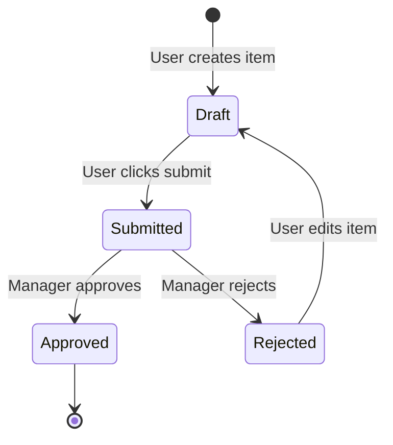
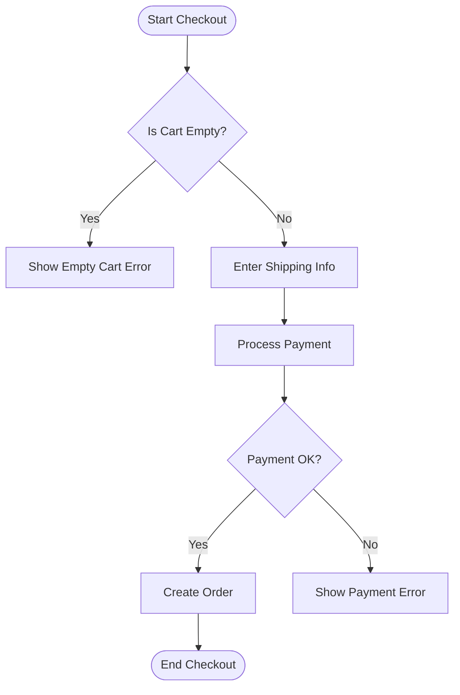
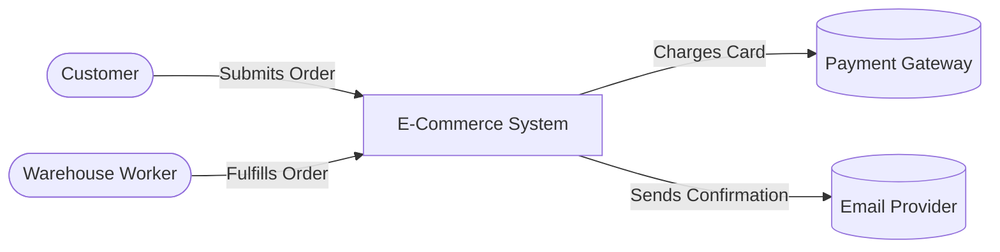

# Mermaid Modeling Templates

Use these Mermaid templates to visualize text requirements.

## 1. State Transition Diagram
*Use when an entity (like an Order, Ticket, or User) moves through different statuses.*

## 2. Activity / Flow Diagram
*Use to show a sequence of steps, decisions, and parallel tasks.*

## 3. Context Diagram
*Use to show how the system interacts with external actors or APIs.*

